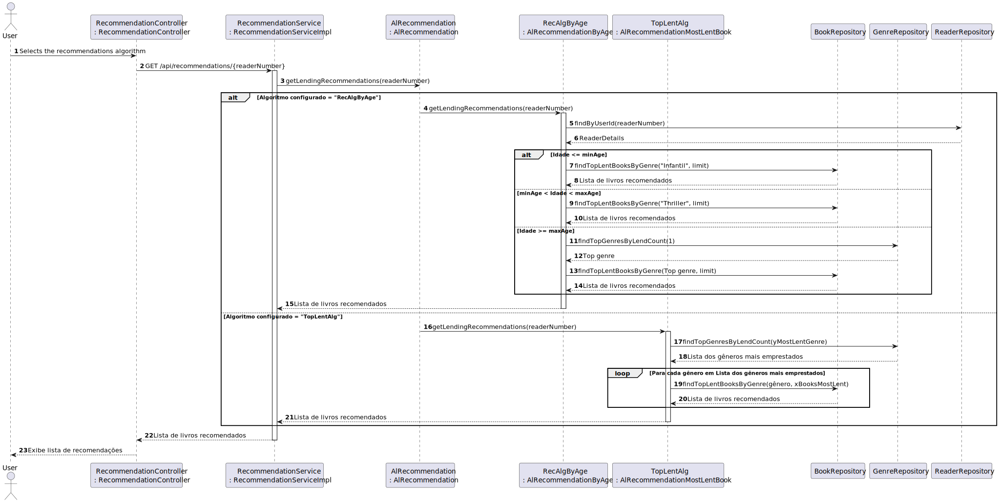

# Recommending Lendings according to varying specifications

---

### Design objective
Recomendação de empréstimos de livros de acordo com diferentes especificações.

---

### Quality Attribute Scenario

| **Element**          | **Statement**                                                                                                                                                                     |
|----------------------|-----------------------------------------------------------------------------------------------------------------------------------------------------------------------------------|
| **Stimulus**         | Existe a necessidade de recomendar empréstimos de livros de acordo com diferentes especificações de acordo com a configuração pretendida pelo product owner em tempo de execução. |
| **Stimulus source**  | Product owner determina o algoritmo de recomendação de empréstimo em tempo de execução.                                                                                           |
| **Environment**      | O sistema processa diferentes algoritmos de recomendação de acordo com detalhes dos utilizadores.                                                                                 |
| **Artifact**         | Motor de recomendacoes                                                                                                                                                            |
| **Response**         | Deve ser desenvolvida uma solução baseada em configuração, que permita selecionar entre vários algoritmos de recomendação possíveis.                                              |
| **Response measure** | Deve ser possível alterar o algoritmo de recomendação pretendido através de um ficheiro de configuração, em 5 minutos.                                                            |

---

### Constraints

- O requisito deve ser implementado com base no serviço REST já existente (LMS).
- O requisito deve ser implementado de forma a recomendar empréstimos com base em certas especificações:

    - **X livros mais emprestados do gênero Y mais emprestado**

    - **Em função da idade do leitor:**
        - idade < 10: X livros do gênero “infantil”
        - 10 ≤ idade < 18: X livros do gênero “juvenil”
        - idade ≥ 18: X livros do gênero mais querido do leitor

  **Nota:** Preferencialmente, as idades 10 e 18 devem ser configuráveis.

---

### Concerns

- **Flexibilidade da Configuração**: O sistema deve permitir a seleção de diferentes algoritmos de recomendação sem necessidade de interromper o serviço.

- **Escalabilidade do Algoritmo**: Os algoritmos de recomendação devem ser escaláveis para lidar com grandes volumes de dados, assegurando uma performance eficiente à medida que o número de livros, géneros e leitores aumenta.

- **Manutenção e Extensibilidade**: A implementação deve ser modular para facilitar a adição de novos critérios de recomendação, como tipos de utilizadores, novos géneros literários ou outras preferências dos leitores.

- **Configuração e Usabilidade**: A configuração através do ficheiro `livrary.properties` deve ser intuitiva e de fácil acesso, de forma que as alterações no algoritmo de recomendação possam ser aplicadas de maneira rápida e sem erros.

---

### Technical Memo

- **Problem**: Recomendar empréstimos de livros de acordo com diferentes especificações.

- **Resumo da Solução**: Implementar uma solução configurável que permita selecionar dinamicamente entre múltiplos algoritmos de recomendação. A recomendação deve ser personalizada, levando em conta a idade do leitor e a popularidade dos livros e gêneros, conforme especificado pelo product owner.

- **Fatores**:
    - As recomendações devem seguir diferentes especificações de acordo com os géneros literários, livros existentes e idades dos utilizadores.
    - O sistema deve permitir a configuração do algoritmo de recomendação.
    - A solução deve permitir alterar o algoritmo de recomendação sem afetar o funcionamento do sistema.

- **Solução**:
    - **Encapsulate**: Criação de uma interface pública que permite com que a implementação interna do módulo mude sem impactar outros módulos que dependem dele.
    - **Use an Intermediary**: Criar um componente que atua entre dois módulos para reduzir a dependência direta entre eles. Esse intermediário vai permitir com que o sistema escolha dinamicamente o algoritmo pretendido.
    - **Abstract Common Services**: Vai facilitar a troca e adição de novos algoritmos sem afetar o sistema.
    - **Defer Binding**: Vai permitir selecionar o algoritmo pretendido em tempo de execução.

- **Motivação**: Manter a flexibilidade de configuração e escalabilidade do sistema de forma a atender à necessidade de promover diferentes algoritmos de recomendação de empréstimos.

- **Alternativas**:
  Adotar apenas um algoritmo, mas isso apesar de diminiur a complexicidade do projeto, limitaria a capacidade de personalizar a experiencia do leitor.

- **Questões pendentes**:
- Quais serão os critérios para usar em cada algoritmo de recomendação?
- Como garantir que o sistema seja capaz de adaptar-se a novas estratégias de recomendação sem impactar o sistema existente?

---

### Vista de Processo

