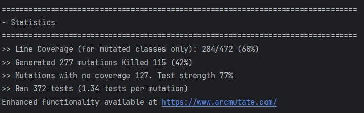
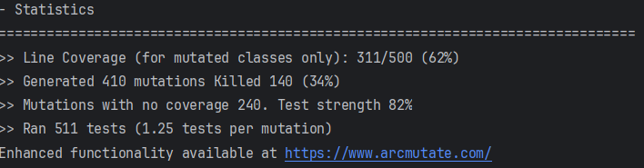

# Vistas
## Vistas de Implementação
## System as Is

### Vista de Implementacao Nivel 1

### Vista de Implementacao Nivel 2

### Vista de Implementacao Nivel 3

### Vista de Implementacao Nivel 4

## System to Be
### Vista de Implementacao Nivel 3

### Vista de Implementacao Nivel 4 RecommendationMgt

## Vistas Lógicas
## System as Is

### Vista Lógica Nivel 1

### Vista Lógica Nivel 2

### Vista Lógica Nivel 3

## System to Be
### Vista Lógica Nivel 1

### Vista Lógica Nivel 2

### Vista Lógica Nivel 3

## Vista Logica X Vista de Implementacao

---
# Architectural Software Requirements (ASR)
## Contexto do Sistema
O sistema é um serviço de backend REST para gestão de uma biblioteca, que contém endpoints para gerir livros, géneros, autores, leitores e empréstimos.

## Problemas
A arquitetura do LMS não suporta:

- Extensibilidade: Dificuldade em adicionar novas funcionalidades sem grandes reestruturações.
- Configurabilidade: Falta de flexibilidade para modificar comportamentos e parâmetros do sistema em tempo de execução.
- Confiabilidade: Necessidade de melhorias na disponibilidade e recuperação de falhas do sistema.
- Persistência de dados: O sistema atual não permite persistir dados em diferentes modelos de SGBDs.

## Requisitos Funcionais
- O sistema deve permitir a persistência de dados em diferentes modelos de dados, como:
  - Modelos relacionais (H2).
  - Modelos de documentos (MongoDB).

- O sistema deve integrar diferentes provedores de IAM (Identidade e Gestão de Acesso) como:
  - Google.
  - Facebook.

- O sistema deve gerar IDs para empréstimos e autores em formatos configuráveis.

- O sistema deve implementar algoritmos de recomendação de empréstimos com base em critérios configuráveis.

## Requisitos Não Funcionais
- Extensibilidade: O sistema deve permitir a adição de novos tipos de dados e funcionalidades sem impacto significativo na arquitetura existente.
- Configurabilidade: O sistema deve ser configurável em tempo de execução através de um arquivo de configuração que não deverá ser superior a 10 minutos.
- Confiabilidade: O sistema deve garantir um mecanismo de recuperação para falhas.
- Desempenho: O tempo de resposta do sistema a cada pedido não deverá superar os 5 segundos. O sistema deve ser projetado para escalar horizontalmente conforme necessário.
- Segurança: O sistema deve garantir a autenticação e autorização de utilizadores.

---

# Tabela de Fatores Arquiteturais

| Fator                       | Qualidade do Cenário                                                                                   | Variabilidade                                                                   | Impacto nos Stakeholders                                                                              | Frequência/Probabilidade | Risco/Gravidade | Prioridade (para resolução) |
|-----------------------------|--------------------------------------------------------------------------------------------------------|---------------------------------------------------------------------------------|-------------------------------------------------------------------------------------------------------|--------------------------|-----------------|-----------------------------|
| Persistência de Dados       | O sistema precisa persistir dados em diferentes sistemas de gestão de base de dados, por configuração. | Suporte a diferentes sistemas de suporte bases de dados (H2, MongoDB)           | Falhas ou erros na persistência irá impactar a disponibilidade e consistência de dados na aplicação.  | **Alta**                 | **Alta (4)**    | **4**                       |
| Provedores IAM              | O sistema deve suportar novos provedores de IAM sem alteração na lógica, por configuração.             | Suporte a diferentes provedores de IAM (Google, Facebook).                      | Falhas na integração dos provedores pode causar incovenientes aos utilizadores da aplicação           | **Média**                | **Média (3)**   | **1**                       |
| Geração de IDs              | O sistema gera IDs em formatos personalizados, sem afetar operações existentes, por configuração.      | Suporte a múltiplos formatos de IDs                                             | Falhas podem limitar um cliente que pode precisar de um formato de ID personalizado.                  | **Baixa**                | **Baixa (2)**   | **2**                       |
| Recomendação de Empréstimos | O sistema deve alternar entre diferentes algoritmos de recomendação por configuração.                  | Suporte a múltiplos algoritmos de recomendação (popularidade, Idade do Leitor). | Falhas no algoritmo de recomendação pode afetar a qualidade de sugestões fornecidas aos utilizadores. | **Média**                | **Média (3)**   | **3**                       |

---

# ADD 
### QAS-01
[Persisting data in different data models and SGBD.md](ADD%2FPersisting%20data%20in%20different%20data%20models%20and%20SGBD.md)
### QAS-02
[Adopting different IAM providers.md](ADD%2FAdopting%20different%20IAM%20providers.md)
### QAS-03
[Generating Lending and Authors IDs in different formats.md](ADD%2FGenerating%20Lending%20and%20Authors%20IDs%20in%20different%20formats.md)
### QAS-04
[Recommending Lendings according to varying specifications.md](ADD%2FRecommending%20Lendings%20according%20to%20varying%20specifications.md)

---

# Testes de Mutação

O resultado dos testes de mutação são possíveis de serem visualizados através das imagens abaixo que foram retiradas através da utilização da JaCoCO para gerar *reports* sobre os testes unitários.

### Primeiro Teste de Mutação

### Segundo Teste de Mutação

